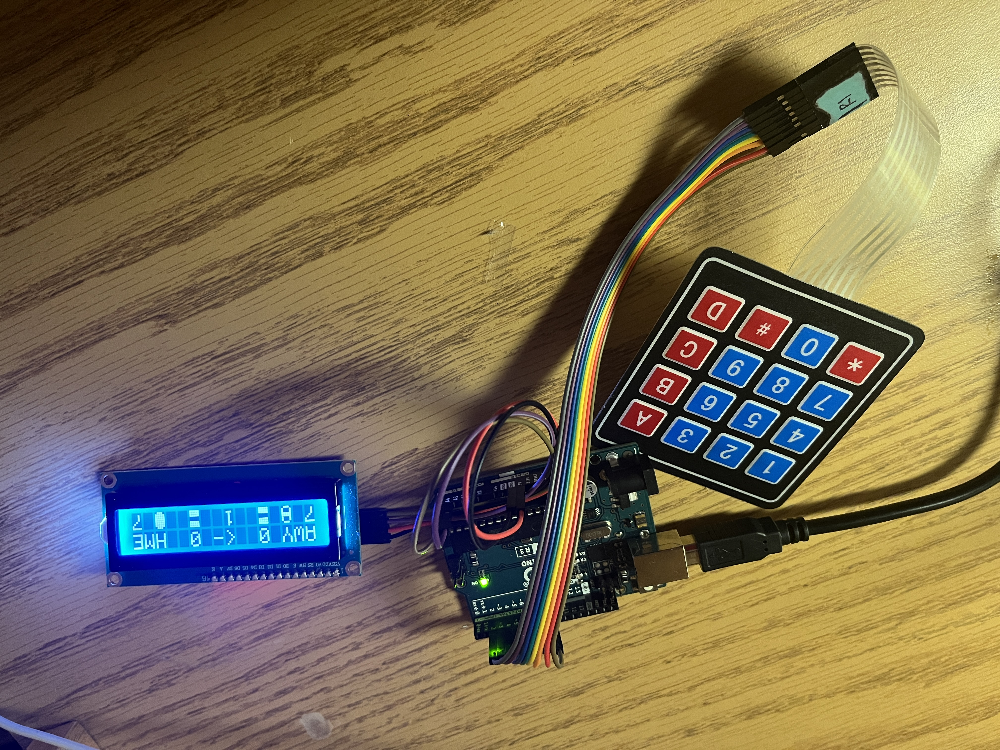

# Speed Pool Scoreboard: Keypad Version
This is the first completed version of the Speed Pool scoreboard, which utilizes keypad for data input, displays the score on an LCD, and adds a few features from the serial verison.
"Speed Pool" is a game I came up with; it has no relation to other games which may also be called "Speed Pool."

## Features
The program loop is structured like a state machine to be compatible with the "infinite loop" behavior of a microcontroller.
Features include:
* Showing the name and score of both teams, as well as the current rack.
* Showing which team is currently playing.
* An indication of how many "sinkless" turns can be done by each team before they incur a "delay of game" foul.
* Visual of which team is on solids and which is on stripes. (although no logic exists for reading or interpreting this state; the visual is strictly for human use)

The rules of play are enforced as follows:
1. every rack, the starting player alternates between home and away.
2. Each team has 7 balls of a certain suit to sink (solids or stripes), before finally sinking the 8-ball, and winning the rack.
3. At the end of each turn, three numbers are entered to give information on what happened:
    * 1st number: 0-8: number of own suit's balls team just sunk
    * 2nd number: 0-8: number of OPPONENT'S suit's balls team just sunk (if > 0, foul will be given later in the logic)
    * 3rd number: 1 => "a different kind of foul was comitted" (scratch, ball leaves table, bumping table, illegal 8-ball sink); 0 => no other fouls made
    * The "D" key can be pressed at any time during input to reset the current entry values, in case an error is made.
    * The "A" key can also be pressed to switch which team is shown to be on solids/stripes.
4. After data has been entered, the Arduino computes logic for deducting ballsToSink for both teams (and also ending the rack if this value goes below zero for either team, for when the 8 ball is sunk legally)
5. Play then switches to the other team. If a foul was made, a * shows on the opposing team's side of the board to indicate they get to go twice in a row. (Values are input to the Arduino after the team has completed both turns.)
6. After the rack is over (either team sinks the 8-ball after sinking all 7 of their "suit balls"), however many ballsToSink the losing team has left, that amount is added to the winning team's score. (If both teams have 0 ballsToSink, the winner gets 3 points.) After this the next rack begins, with the opposite team from whichever one started last time getting the first turn this time.
7. The logic has no concept of a maximum score to hit in order to win, although in practice I've found 25 and 30 to be good numbers.

## Circuit Assembly

To assemble the circuit, a 4x4 keypad and i2c LCD display are needed in addition to an Arduino:
* Keypad pin R1 -> Arduino digital pin 9. Successive keypad pins are then attached to descending digital pins, until keypad pin C4 is attached to Arduino digital pin 2.
* SDA pin of LCD -> analog pin A4
* SCL pin of LCD -> analog pin A5
* ground and VCC of LCD -> gnd and 5v pins of Arduino

